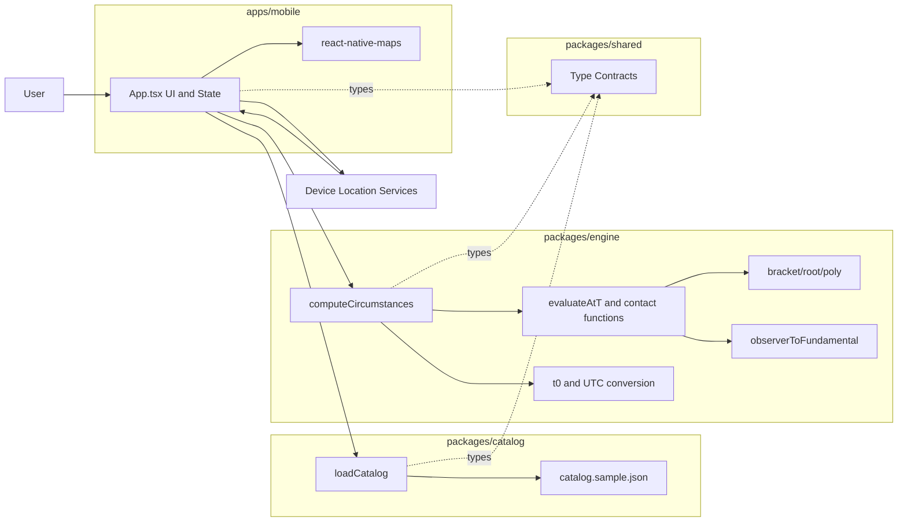
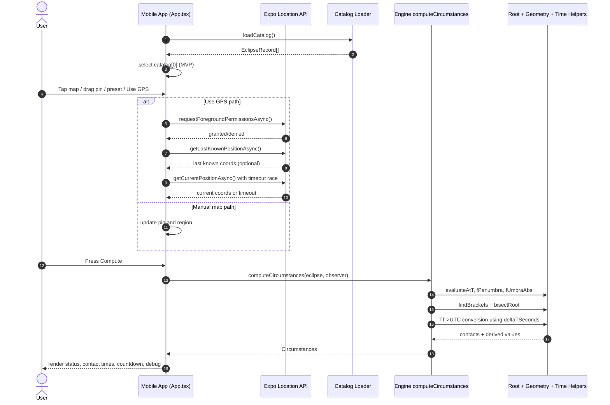

# System Overview

## Project Summary

`eclipse-timer` is a pnpm monorepo containing:
- A React Native (Expo) mobile app for selecting a location and viewing eclipse contact timings.
- A TypeScript eclipse engine that evaluates Besselian-element-based circumstances for an observer.
- Shared type contracts and a catalog package for eclipse dataset loading.

## Repository Layout

- `apps/mobile`
  - Expo app, map UI, GPS integration, and compute trigger.
- `packages/engine`
  - Core eclipse computation logic.
- `packages/catalog`
  - Catalog loader and sample eclipse dataset (`catalog.sample.json`).
- `packages/shared`
  - Shared TypeScript types used by app and engine.

## Package Dependency Graph

- `@eclipse-timer/mobile` -> `@eclipse-timer/catalog`, `@eclipse-timer/engine`, `@eclipse-timer/shared`
- `@eclipse-timer/engine` -> `@eclipse-timer/shared`, `@eclipse-timer/catalog`
- `@eclipse-timer/catalog` -> `@eclipse-timer/shared`
- `@eclipse-timer/shared` -> no internal package deps

## Runtime Data Flow

1. Mobile app loads catalog via `loadCatalog()` and selects the first eclipse record (MVP behavior).
2. User sets observer location from map tap/drag, GPS, or preset shortcuts.
3. User taps `Compute`.
4. App calls `computeCircumstances(eclipse, observer)`.
5. Engine returns contact times, visibility, local eclipse kind, magnitude, duration, and debug info.
6. UI renders results and a next-event countdown.

## Architecture Diagrams

### Component Diagram

### Sequence Diagram

## Operational Constraints (Current State)

- Catalog selection is hardcoded to the first record.
- Time conversion uses record-level `deltaTSeconds`.
- Quality automation is scaffolded but not implemented (lint/test scripts are placeholders).
